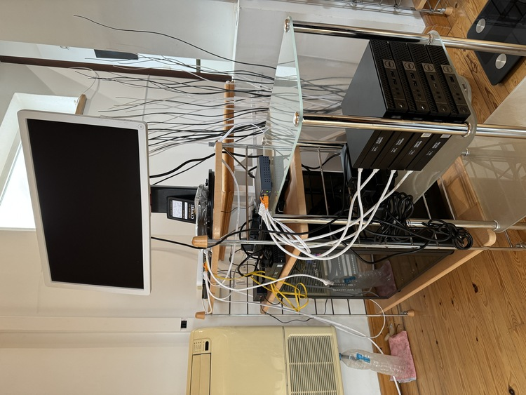

# Hi there 👋

I'm a software developer who loves web development, devops, and cloud computing. I'm always looking for new challenges and learning new things.

Currently working fulltime Bipi as Backend Developer

[bipicar.com](https://www.bipicar.com)

## Experience

Professionally, I've been working since 2016 but I always loved doing things with computers, the first lines of code I wrote were in 2007 or so, when I was 14 years old.

## Personal projects

I also have some personal projects that I love working on. The main one is LoboBot, a web application that allows you create some Leage of Legends widgets for your stream.

[lobobot.com](https://lobobot.com)

### Public npm packages

* [@javilobo8/riot-api](https://github.com/javilobo8/riot-ap) - A Node.js wrapper for the Riot Games API.
* [@javilobo8/zoso](https://github.com/javilobo8/zoso) - An encryption/decryption utitlity for Node.js for manage configuration files with sensitive data.
* [@javilobo8/zoso-loader](https://github.com/javilobo8/zoso-loader) - A loader for configurations rendered with `@javilobo8/zoso` for Node.js.

## Side projects

**Se Sei Forte Sali**, a web application for an amateur tournament about League Of Legends. The website shows the different league leaderboards, the matches, and the players' stats.

[seseifortesali.com](https://seseifortesali.com)

## Technologies I use every day

### Programming languages

### Databases

### Cloud & DevOps & Monitoring

## Homelab

I also have a homelab where I play with some technologies and services. I have two Kubernetes cluster (one for development and other for production), a NAS, and some other services running.

### Stack

These are all the computers as 24/7 servers clusterized with Proxmox:

- ASUS Z390A, i9 9900k, 64GB RAM 3200Mhz, 500GB NVMe, 2x 4TB SSD, 8TB HDD
- 1x Dell Optiplex 3050 i5 6500T, 16GB RAM 2400Mhz
- 2x Dell Optiplex 7040 i7 6700T, 24GB RAM 2133Mhz
- 2x Dell Optiplex 7050 i5 7500T, 1x 16GB RAM 2400Mhz, 1x 32GB RAM 2400Mhz
- <del>1x Beelink Mini-S Intel N5095A, 8GB RAM 2400Mhz</del> **DEAD**

  
Homelab photo

  

