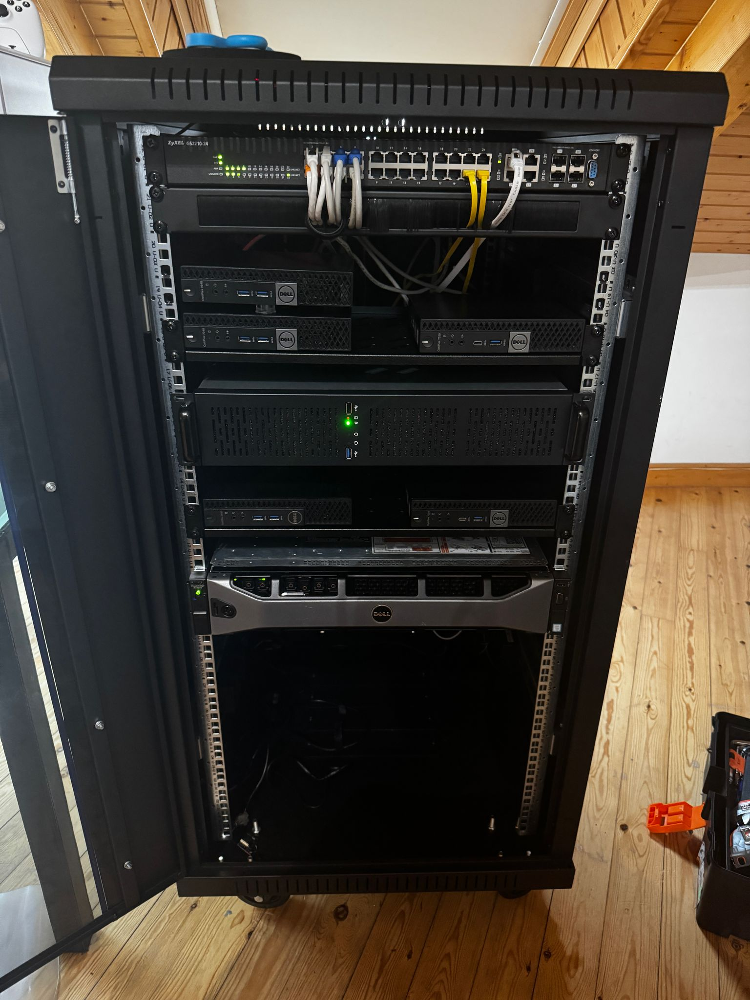

# 👋 Hi, I'm Javi

### Fullstack Developer | DevOps Enthusiast | Homelab Tinkerer

---

## 💼 About Me

I'm a passionate software developer specializing in **web development**, **DevOps**, and **cloud computing**. With a love for learning and tackling new challenges, I've been professionally coding since 2016, but my journey began much earlier—writing my first lines of code in 2007 at just 14 years old.

### 🚀 Currently Working At

**Fullstack Developer @ [embat.io](https://embat.io)**

📜 <b>Previous Experience</b>

 

---

## 🎯 Personal Projects

Building solutions I'm passionate about, focusing on gaming communities and web applications.

<table>
<tr>
<td width="50%">

### 🎮 [LoboBot](https://lobobot.com)

A comprehensive web application for creating **League of Legends widgets** for streamers.

</td>
<td width="50%">

### 📊 [Buffit.lol](https://buffit.lol)

Advanced League of Legends statistics and analytics platform.

</td>
</tr>
</table>

### 🌐 [javilobo8.com](https://javilobo8.com)

My personal website and blog.

---

## 📦 Open Source Contributions

<table>
<tr>
<td width="33%">

#### [@javilobo8/riot-api](https://github.com/javilobo8/riot-api)

Node.js wrapper for the Riot Games API

</td>
<td width="33%">

#### [@javilobo8/zoso](https://github.com/javilobo8/zoso)

Encryption/decryption utility for managing sensitive configuration files

</td>
<td width="33%">

#### [@javilobo8/zoso-loader](https://github.com/javilobo8/zoso-loader)

Configuration loader for `@javilobo8/zoso`

</td>
</tr>
</table>

---

## 🎲 Side Projects

### 🏆 [Se Sei Forte Sali](https://seseifortesali.com) _(currently offline)_

Amateur League of Legends tournament platform featuring leaderboards, match tracking, and player statistics.

---

## 🛠️ Tech Stack

### 💻 Languages & Runtimes

### 🗄️ Databases

### ☁️ Cloud, DevOps & Monitoring

---

## 🏠 Homelab

I maintain a personal homelab for experimentation and production services, featuring **two Kubernetes clusters** (development & production), a NAS, and various self-hosted services.

### 🖥️ Hardware Arsenal

<b>🖥️ Desktops</b>

- **ASUS B760-I ROG Strix** — 32GB RAM 5600MHz DDR4, Gigabyte 3080ti OC 12GB - Gaming
- **Mac Mini M4** — 16GB RAM, 256GB SSD - Development

<b>💻 Laptops</b>

- **Lenovo T480 14"** — i5 8350U 1.7 GHz, 16GB RAM 2400MHz DDR4 - Omarchy
- **MacBook Pro 13" 2019** — i7, 16GB RAM, 1TB SSD - Sequoia 15.7.2

<b>🗄️ Servers</b>

- **Dell PowerEdge R730xd 26SFF** — 2× Intel Xeon E5-2650v4, 128GB RAM 2133MHz DDR4, H730p Mini
- **ASUS Z390A** — i9 9900K, 64GB RAM 3200MHz DDR4, Gigabyte 1080ti 11GB, 8TB HDD, 1TB SSD
- **Gigabyte B760M** — i5 12400, 32GB RAM 3200MHz DDR4
- **Gigabyte B760-PLUS** — i5 13400F, 32GB RAM 5600MHz DDR5, No GPU _(offline)_
- **Dell Optiplex 3050** — i5 6500T, 16GB RAM 2400MHz DDR4
- **2× Dell Optiplex 7040** — i7 6700T, 32GB RAM 2133MHz DDR4
- **2× Dell Optiplex 7050** — i5 7500T, 16GB RAM 2400MHz DDR4

#### ⚰️ Retired Hardware

- ~~Beelink Mini-S Intel N5095A, 8GB RAM 2400MHz DDR4~~ 💀
- ~~Beelink U59 Pro Mini-PC Intel N5105, 16GB RAM 2400MHz DDR4~~ 💀

<b>📸 Homelab Photos</b>

 

_My homelab setup in action_

